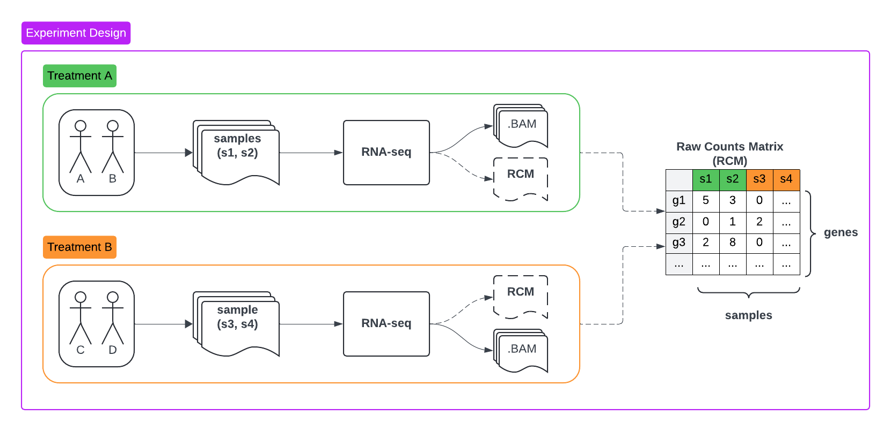

# Takuan


[](https://codecov.io/gh/bento-platform/transcriptomics_data_service)


Takuan is a REST API data service for transcriptomics data.

It is intended to ingest, organize and query data from transcriptomics experiments through an API.

Takuan stores its data in a PostgreSQL database.

# Data

Takuan handles data produced in transcriptomics experiments.

For a given experiment, samples taken from study participants are selected for RNA sequencing.

At the end of an RNA sequencing pipeline, a raw counts matrix (RCM) is usually produced, this matrix 
is used to represent the gene expression levels per samples.

To express this in a tabular format, Takuan expects to receive RCM files in CSV format, where the colums correspond 
to unique sample identifiers, rows to unique feature identifiers (genes) and cells to the observed count for the sample-gene pair.



Once the data is produced, it can be ingested in Takuan in order to allow downstream analysis of the results.

## Data model and flow

In order to ingest and query data into Takuan, you must follow these steps:

1. Create an `experiment`, in which we will later ingest gene expression data
   1. POST `/experiment`
   2. JSON body describing the experiment, where
      1. `experiment_result_id` is a unique identifier for the experiment
      2. `assembly_id` is the assembly accession ID used in the experiment
      3. `assembly_name` is the genome assembly name used in the experiment
      4. `extra_properties` is a JSON object where you can place additional meta data
2. Ingest an RCM into the experiment you created
   1. POST `/experiment/{experiment_result_id}/ingest`
      1. Where `experiment_result_id` must correspond to an existing experiment ID in Takuan
      2. A valid RCM file must be in the request's body as `rcm_file`
   2. During the ingestion, Takuan creates a `gene_expression` row for every pair of sample-gene
3. The `gene_expression` table now contains rows with the `raw_count` column filled
4. Normalized counts can be computed on demand and stored in the database
   1. POST `/normalize/{experiment_result_id}/{method}`
      1. `experiment_result_id` is the ID of an experiment with raw gene expressions
      2. `method` is the normalization method to use (TPM, TMM or GETMM)
      3. `TPM` and `GETMM` both **require** that you include a `gene_lengths` CSV file in the body
   2. Normalized values are added in the appropriate column of `gene_expression`
5. Query the experiments and gene expressions in your DB!
   1. POST `/expressions` to get expression data results
      1. JSON request body for filtering results and pagination
   2. POST `experiment/{experiment_result_id}/samples` to get the sample IDs for an experiment
   3. POST `experiment/{experiment_result_id}/features` to get the gene IDs for an experiment

## Synthetic data

Valid synthetic transcriptomics data can be produced for Takuan.

To do so, please follow the steps detailled in the [Bento Demo Dataset](https://github.com/bento-platform/bento_demo_dataset)
repository.

After following the instructions, 4 relevant files are produced for Takuan:
- `counts_matrix_group_1.csv`
- `counts_matrix_group_2.csv`
- `counts_matrix_group_3.csv`
- `gene_lengths.csv`

The count matrices can be ingested into Takuan as is.
The gene lengths file can be used as is to normalize ingested expressions.

For testing purposes, this repository includes an RCM and gene lenghts file:
- [rcm_file.csv](tests/data/rcm_file.csv)
- [gene_lengths.csv](tests/data/gene_lengths.csv)

# Configuration

### Environment variables

The following environment variables should be set when running a Takuan container:

| Name               | Description                                             | Default    |
| ------------------ | ------------------------------------------------------- | ---------- |
| `AUTHZ_ENABLED`    | Enables/disables the authorization plugin.              | `False`    |
| `CORS_ORIGINS`     | List of allowed CORS origins                            | `Null`     |
| `DB_HOST`          | IP or hostname of the database                          | `tds-db`   |
| `DB_PORT`          | Database port                                           | `5432`     |
| `DB_USER`          | Database username                                       | `tds_user` |
| `DB_NAME`          | Database name                                           | `tds`      |
| `DB_PASSWORD`      | DB_USER's Database password                             | `Null`     |
| `DB_PASSWORD_FILE` | Docker secret file for DB_USER's Database password      | `Null`     |
| `TDS_USER_NAME`    | Non-root container user name running the server process | `Null`     |
| `TDS_UID`          | UID of TDS_USER_NAME                                    | `1000`     |

**Note:** Only use `DB_PASSWORD` or `DB_PASSWORK_FILE`, not both, since they serve the same purpose in a different fashion.

## Using Docker Secrets for the PostgreSQL credential

The Takuan [`Config`](./transcriptomics_data_service/config.py) object has its values populated from environment variables and secrets at startup.

The `Config.db_password` value is populated by either:
- `DB_PASSWORD=<a secure password>` if using an environment variable
  - As seen in [docker-compose.dev.yaml](./docker-compose.dev.yaml)
- `DB_PASSWORD_FILE=/run/secrets/db_password` if using a Docker secret (recommended)
  - As seen in [docker-compose.secrets.dev.yaml](./docker-compose.secrets.dev.yaml)

Using a Docker secret is recommended for security, as environment variables are more prone to be leaked.

`DB_PASSWORD` should only be considered for local development, or if the database is secured and isolated from public access in a private network.

## Authorization plugin

The Transcriptomics Data Service is meant to be a reusable microservice that can be integrated in existing 
stacks. Since authorization schemes vary across projects, Takuan allows adopters to code their own authorization plugin, 
enabling adopters to leverage their existing access control code, tools and policies.

See the [authorization docs](./docs/authz.md) for more information on how to create and use the authz plugin with Takuan.

## Starting a standalone Takuan

Start the Takuan server with a local PostgreSQL database for testing by running the following command.
```bash
# start
docker compose up --build -d

# stop
docker compose down
```
The `--build` argument forces the image to be rebuilt. Be sure to use it if you want code changes to be present.

You can now interact with the API by querying `localhost:5000/{endpoint}`

For the OpenAPI browser interface, go to `localhost:5000/docs`.

## Local dev

For local development, you can use the [docker-compose.dev.yaml](./docker-compose.dev.yaml) file to start a Takuan 
[development container](https://code.visualstudio.com/docs/devcontainers/containers) that mounts the local directory.
The server starts in reload mode to quickly reflect local changes, and debugpy is listening on the container's internal port `9511`.

```bash
# Set UID for directory permissions in the container
export UID=$(id -u)

# start
docker compose -f ./docker-compose.dev.yaml up --build -d

# stop
docker compose -f ./docker-compose.dev.yaml down
```

You can then attach VS Code to the `takuan` container, and use the preconfigured `Python Debugger (Takuan)` for interactive debugging.

## Using Docker Secrets for the PostgreSQL credential

The Takuan [`Config`](./transcriptomics_data_service/config.py) object has its values populated from environment variables and secrets at startup.

The `Config.db_password` value is populated by either:
- `DB_PASSWORD=<a secure password>` if using an environment variable
  - As seen in [docker-compose.dev.yaml](./docker-compose.dev.yaml)
- `DB_PASSWORD_FILE=/run/secrets/db_password` if using a Docker secret (recommended)
  - As seen in [docker-compose.secrets.dev.yaml](./docker-compose.secrets.dev.yaml)

Using a Docker secret is recommended for security, as environment variables are more prone to be leaked.

`DB_PASSWORD` should only be considered for local development, or if the database is secured and isolated from public access in a private network.

## Authorization plugin

The Transcriptomics Data Service is meant to be a reusable microservice that can be integrated in existing 
stacks. Since authorization schemes vary across projects, Takuan allows adopters to code their own authorization plugin, 
enabling adopters to leverage their existing access control code, tools and policies.

See the [authorization docs](./docs/authz.md) for more information on how to create and use the authz plugin with Takuan.

## GA4GH Service Info

This service implements GA4GH's Service-Info [spec](https://www.ga4gh.org/product/service-info/).

If left unconfigured, a default service info object will be returned.

For adopters outside of the Bento stack, we recommend that you provide a custom service info object when deploying.

This can be done by simply mounting a JSON file in the Takuan container.

When starting, the service will look for a JSON file at `/tds/lib/service-info.json`.

If the file exists, it will be served from the `GET /service-info` endpoint, otherwise the default is used.


## Endpoints

The service exposes the following endpoints:

| Endpoint                                      | Method | Description                                                                                    |
| --------------------------------------------- | ------ | ---------------------------------------------------------------------------------------------- |
| `/experiment`                                 | GET    | Get all experiments                                                                            |
| `/experiment`                                 | POST   | Create an experiment                                                                           |
| `/experiment/{experiment_result_id}`          | GET    | Get an experiment by unique ID                                                                 |
| `/experiment/{experiment_result_id}`          | DELETE | Delete an experiment by unique ID                                                              |
| `/experiment/{experiment_result_id}/samples`  | POST   | Retrieve the samples for a given experiment                                                    |
| `/experiment/{experiment_result_id}/features` | POST   | Retrieve the features for a given experiment                                                   |
| `/experiment/{experiment_result_id}/ingest`   | POST   | Ingest transcriptomics data into an experiment                                                 |
| `/normalize/{experiment_result_id}/{method}`  | POST   | Normalize an experiment's gene expressions with one of the supported methods (TPM, TMM, GETMM) |
| `/expressions`                                | POST   | Retrieve expressions with filter parameters                                                    |
| `/service-info`                               | GET    | Returns a GA4GH service-info object describing the service                                     |


<!-- TODO: Deploy a Swagger UI pointing to the latest release once we have one. -->
**Note:** For a more thorough API documentation, please refer to the OpenAPI release artifacts (openapi.json), or consult the hosted docs (link to come).

## Docker images

The Transcriptomics Data Service is packaged and released as a Docker image using GitHub Actions.

Images are published in GitHub's container registry, [here](https://github.com/bento-platform/takuan/pkgs/container/takuan).

Images are built and published using the following tags:
- `<version>`: Build for a tagged release
- `latest`: Build for the latest tagged release
- `edge`: The top of the `main` branch
- `pr-<number>`: Build for a pull request that targets `main`

**Note:** Images with the `-dev` suffix (e.g. `edge-dev`) are based on `dev.Dockerfile` for local development.


To pull an image, or reference it in a compose file, use this pattern:

```shell
docker pull ghcr.io/bento-platform/takuan:<TAG>
```
