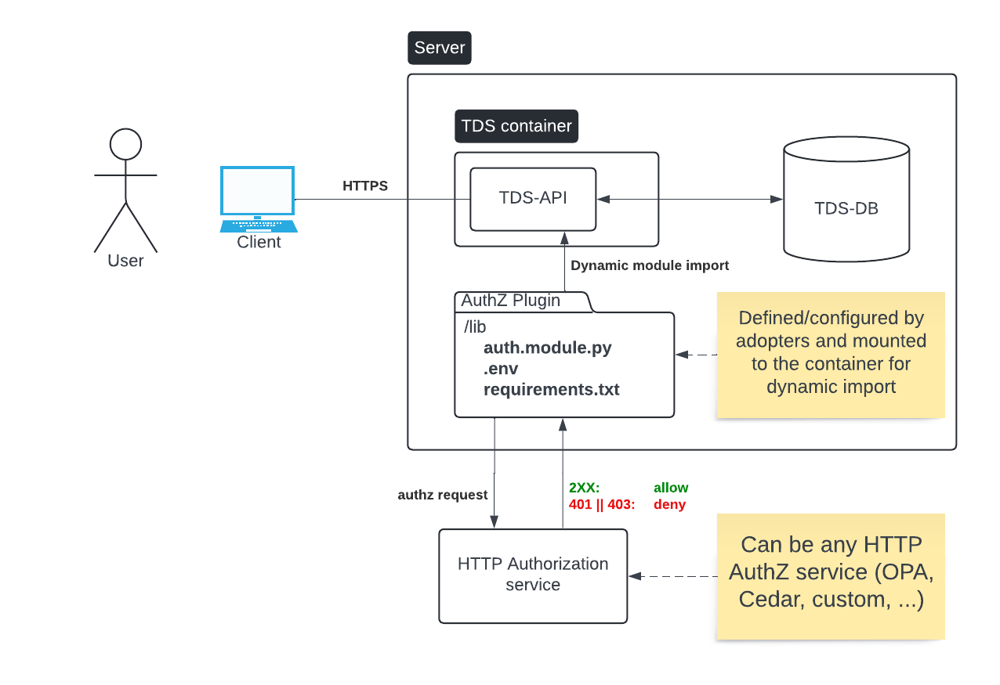

# Authorization plugin

Although Takuan is part of the Bento platform, it is meant to be reusable in other software stacks.

Since authorization requirements and technology vary wildy across different projects, 
Takuan allows adopters to write their own authorization logic in python.

For different authorization requirements, you could choose to write a custom module that performs authorization checks based on:
* An API key in the request header or in a cookie
* A JWT bearer token, for example you could:
  * Allow/Deny simply based on the token's validity (decode + TTL)
  * Allow/Deny based on the presence of a scope in the token
  * Allow/Deny based on the presence of a group membership claim
* The results of API calls to an authorization service
* Policy engine evaluations, like OPA or Casbin



## Implementing an authorization plugin

When starting the Takuan container, the FastAPI server will attempt to dynamicaly load the authorization plugin 
middleware from `lib/authz.module.py`.

If authorization is enabled and there is no file at `lib/authz.module.py`, an exception will be thrown and the server
will not start.

Furthermore, the content of the file must follow some implementation guidelines:
- You MUST declare a concrete class that extends [`BaseAuthzMiddleware`](./transcriptomics_data_service/authz/middleware_base.py)
- In that class, you MUST implement the required functions from `BaseAuthzMiddleware`:
- Finally, the script should expose an instance of your concrete authz middleware, named `authz_middleware`.

Looking at [bento.authz.module.py](../authz_plugins/bento.authz.module.py), we can see an implementation that is specific to 
Bento's authorization service and libraries.

Rather than directly implementing the `attach`, `dispatch` and other authorization logic, we rely on the `bento-lib` 
`FastApiAuthMiddleware`, which already provides a reusable authorization middleware for FastAPI.

The only thing left to do is to implement the authorization check functions.

The next sections cover the specific methods that can be implemented to perform authorization.

### Dependency injection

The authorization middleware plugin leverages [FastAPI's dependency injection mechanisms](https://fastapi.tiangolo.com/tutorial/dependencies/).

This simple yet powerful pattern allows us to integrate custom parametrized authorization checks at different levels of the application.

In FastAPI, dependencies can be injected at different levels:
- App
  - Affect ALL requests
- Routers
  - Only affect the router's requests
- Endpoints
  - Only affect the endpoint's requests

The wiring of the dependency injection system is already in place, 
adopters only need to implement the authorization checks as injectable dependencies in their implementation of `BaseAuthMiddleware`.

### Lifecycle methods

These methods determine the authz middleware's lifecycle behaviour. That is to say, how it attaches to the FastAPI app and how it handles
the incoming requests.

| Lifecycle methods | Requires Implementation | Description                                                                                 |
| ----------------- | ----------------------- | ------------------------------------------------------------------------------------------- |
| `dispatch`        | YES                     | Middleware dispatch executed for all requests. Handle  authorization errors/exceptions here |
| `attach`          | NO                      | Attaches the middleware to the FastAPI app                                                  |
| `mark_authz_done` | NO                      | Marks that the authz check on a request was performed for later handling in `dispatch`.     |

The `dispatch` function is the most important among them, since it is responsible for handling the authorization exceptions raised by the
authorization functions. A poor implementation could lead to broken access-control.

While `attach` and `mark_authz_done` already have a default implementation, they can be overriden if needed.

### App and router dependency methods

These methods define dependencies that will be injected in the FastAPI app itself, or its routers, above the endpoints layer.
Authorization checks can be performed at this level rather than at the endpoints level.

This is useful for all-or-nothing authorization logic, such as API key authorization, 
where the API key should be present in all requests.

If you are performing authz checks using these methods, make sure to raise an exception on unauthorized requests.

| App/router dependency methods  | Description                                                                                      |
| ------------------------------ | ------------------------------------------------------------------------------------------------ |
| `dep_app`                      | Returns a list of injectables that will be added as app dependencies, covering ALL paths         |
| `dep_expression_router`        | Returns a list of injectables for the expression router, covers `/expressions` endpoints         |
| `dep_experiment_result_router` | Returns a list of injectables for the expression router, covers `/experiment` endpoints          |

### Endpoints authorization methods

These methods define dependencies that will be injected on specific endpoints.
If an endpoint must be protected by authz, implement the authz check for the appropriate endpoint.

Again, make sure to raise exceptions on unauthorized requests and that the `dispatch` method handles said exceptions correctly.

| Endpoint authorization methods       | Description                                                                          |
| ------------------------------------ | ------------------------------------------------------------------------------------ |
| `dep_public_endpoint`                | Returns injectable authz functions for public endpoints (applied to `/service-info`) |
| `dep_authz_ingest`                   | Returns injectable authz functions for the `/ingest` endpoint                        |
| `dep_authz_normalize`                | Returns injectable authz functions for the `/normalize` endpoint                     |
| `dep_authz_expressions_list`         | Returns injectable authz functions for the `/expressions` endpoint                   |
| `dep_authz_delete_experiment_result` | Returns injectable authz functions for the `/experiment (DELETE)` endpoint           |
| `dep_authz_get_experiment_result`    | Returns injectable authz functions for the `/experiment (GET)` endpoint              |

## Using an authorization plugin

When using the production image, the authz plugin must be mounted correclty on the container.
Assuming you implemented an authz plugin at `~/custom_authz_lib/authz.module.py`, mount the host directory
to the container's `/tds/lib` directory.

```yaml
services:
  tds:
    image: transcriptomics_data_service:latest
    container_name: tds
    # ...
    volumes:
      # Mount the directory containing authz.module.py, NOT the file itself
      - ~/custom_authz_lib:/tds/lib

  tds-db:
    # ... Omitted for simplicity
```

## Providing extra configurations for a custom authorization plugin

You can add custom settings for your authorization plugin.
Following the API key authorization plugin [example](../authz_plugins/api_key/README.md), 
you will notice that the API key is not hard coded in a variable, but imported from the pydantic config.

The Takuan pydantic settings are configured to load a `.env` file from the authz plugin mount.
After the `.env` is loaded, you can access the extra settings with: `config.model_extra.get(<lowercase .env var name>)`.

In other scenarios, you could store any configuration values required for your authorization logic.

## Defining additional python dependencies

When implementing an authorization plugin, you may realize that the default python modules used in Takuan are not enough
for your needs.

Maybe you want to use OPA's Python client to evaluate policies, or an in-house Python library your team made for this
purpose.

While the dependencies declared in [pyproject.toml](../pyproject.toml) are fixed for a given Takuan release,
you can still speficy extra dependencies to be installed when the container starts!

To do so, add a `requirements.txt` file to the authz plugin mount.
During the initialization of the container, these additional dependencies will be installed,
allowing your plugin to use them.

**Note: It is the plugin implementer's responsibility to ensure that these additional dependencies
don't conflict with those in [pyproject.toml](../pyproject.toml)**

# Reference implementations

For examples on how authorization plugins are implemented, please refer to the following:
- [Bento authorization service plugin](../authz_plugins/bento/README.md)
- [API key authorization plugin](../authz_plugins/api_key/README.md)
- [OPA authorization plugin](../authz_plugins/opa/README.md)
